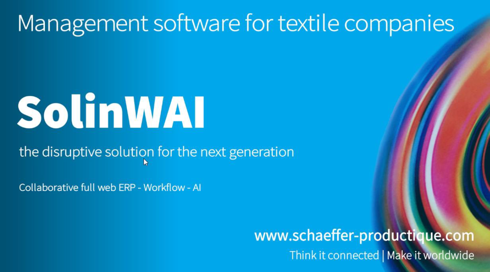

# RAPPORT DE STAGE 2021

## REMERCIEMENTS
## 1. INTRODUCTION
 Les deux années qui viennent de s'écouler ont été le lieu de mon initation au métiers de l'informatique. Ces deux années se sont révélées riches en expériences sur le plan scolaire comme sur le plan professionnel.Ces quelques lignes introduisent la conclusion des deux premières années de mon apprentissage du métier de développeur web.
## 2. L'ENTREPRISE
### DESCRIPTION ET HISTORIQUE
- _Des origines à la révolution industrielle_

Historiquement, l’entreprise Schaeffer voit le jour à la fin du XVIIIe siècle, en 1798 avec la fondation d’un atelier de blanchiment à Pfastatt-le-Château. Grâce à la première révolution industriel, l’entreprise prospère tout au long du XIXe siècle, au point d’étendre son activité textile jusqu’en Afrique de l’ouest.
- _Expansion et mondialisation_

À la moitié du XXe siècle, l’entreprise réduit son activité industrielle. La mondialisation et le mouvement de délocalisation des grandes activités industrielles dans les pays émergents du Moyen-Orient et d’Asie, amènent le groupe à se spécialiser dans la conception et l'ingénierie d’usine neuve.
- _Fin de l’activité textile, début de l’informatique_

L’ère de Schaeffer Engineering dur un peu plus de 20 ans. En 1994 le groupe coté en bourse subit une __OPA__ (à préciser). L’entreprise est rebaptisée Schaeffer-Dufour. Durant la fin des année 90 et le début des années 2000, l’entreprise vit sa dernière métamorphose à ce jour, et arrête toute activité industrielle. En 1996 elle vend sa branche informatique à ses employés constitués en holding. C’est le début de Schaeffer Productique.
- _Aujourd'hui_

Passé de la blanchisserie à éditeur de progiciel, avec une longévité record de plus de 2 siècles, l’entreprise partage avec un pan entier de l’histoire industrielle textile une proximité qui façonne, encore aujourd’hui, ses choix. La spécialisation du secteur d’activité de sa clientèle permet à Schaeffer productique de ne pas se limiter à l’édition pure et de proposer un service complet de conseil et de solution d’optimisation des services d’information.
Avec une expertise métier et une place de leader sur le marché européen des ERP textile, Schaeffer Productique projette avec sérénité la conversion de ses services vers les nouvelles technologies du web et de l’intelligence artificielle.
### ORGANISATION
### ACTIVITÉ DE L'ENTREPRISE
#### L'EDITION DE LOGICIELS ORIENTES TEXTILES
## 3. MES MISSION DANS L'ENTREPRISE
### LE PROJET SOLINWAI
#### L'API
#### L'INTERFACE GRAPHIQUE
### COMMENT ÇA MARCHE ?
### LES OUTILS
## 4. MES APPORTS
### LES ÉVOLUTIONS
### LES DIFFICULTÉS
## 5. CONCLUSION
## 6. BIBLIOGRAPHIE